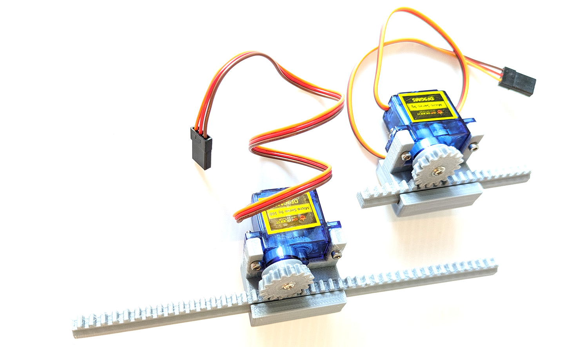

# Linear Actuator Example

This is an example of a linear actuator mechanism that can be used in various projects.

## Files

You can find the STL files for this mechanism in the [mechanisms folder](/mechanisms/).

## Description

Linear actuators convert rotational motion to linear motion, allowing for precise control of movement along a straight line. These mechanisms are commonly used in robotics, automation systems, and various mechanical applications.

## Usage

The STL files can be 3D printed using standard FDM printers
